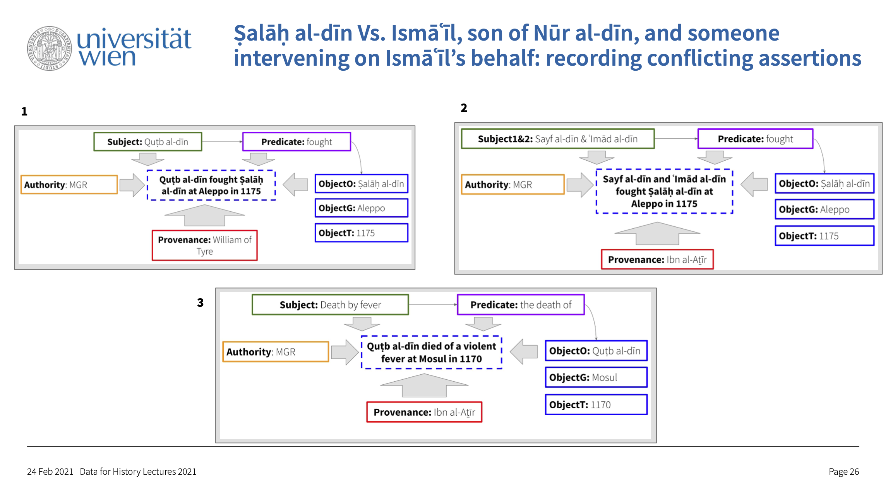

# bibliography

In fact, this is a little more than just a bibliography. This repository is to keep track of:

- bibliography of primary and secondary sources;
- identifiers of contributors;

# Structure

- `./bibFiles/` :: bib files for individual records, named using their bibTeX keys; automatically generated from large bibTeX files added to `./data/bibTeX_primary/` and `./data/bibTeX_secondary/`.
- `./data/` :: subfolders `./data/bibTeX_primary/` and `./data/bibTeX_secondary/` for uploading large bibTeX files;
- `./scripts/` :: contains `split_bib_files.py` script that parses large bibliographies into individual bib files and aggregates browsable `bibTex_pri.tsv` and `bibTex_sec.tsv` files;
- `bibTex_pri.tsv` can be used to find a reference to a primary source; generated automatically;
- `bibTex_sec.tsv` can be used to find a reference to a secondary source; generated automatically;
- `contributors.yml` file for keeping track of contributor URIs; can be edited directly on github;
- `references.yml` file to keep track of references; can be edited directly on github;
- `README.md` is this file;


## STAR-like Assertions

- the idea is from Tara Andrews (<https://releven.univie.ac.at/>, ERC Consolidator Grant #101002357): instead of traditional SPO model, we may benefit from using a "structured assertion record" (the proposed CDOC-CRM standard is too complex though for collecting data):
	- ASSERTION:
		- SUBJECT
		- PREDICATE
		- OBJECT (OObject, OGeo, and OTime)
		- AUTHORITY
		- PROVENANCE



## Adaptation to OpenITI YML files:

- ASSERTION: can be given in the `COMMENT` field of the YML file, especially if the coded assertion has some ambiguities.
	- SUBJECT: not coded, since the URI of the YML file is the SUBJECT; implied by the filename;
	- PREDICATE: free vocabulary to be normalized during metadata revisions; always in first position;
		- **format**: `englishWords[_arabicWords]?`
	- OBJECT (OObject, OGeo, and OTime); each following a specific REGEX pattern (below); separated with commas;
		- **format**:
			- OObject: `AuthorURI` from OpenITI (if not in OpenITI, must be suggested using the same pattern);
			- OGeo: `Althurayya_URI` (if not in Althurayya, must be suggested using the same pattern);
			- OTime:
				- `YYYY_MMM_DD`, unknown elements are coded with `X`; codes for Islamic months are defined;
				- `YYYY_MMM_DD::YYYY_MMM_DD` for periods; unknown elements are coded with `X`; codes for Islamic months are defined;
	- AUTHORITY: follows a pattern;
		- **format:** `AUTH_ContrURI`, where `ContrURI` is the unique identifier of contributors to the OpenITI project;
		- a YML file is required for storing these `ContrURI` with detailed descriptions as values;
	- PROVENANCE (*alternative*):
		- **format:**:
			- `PROV_(\d){12}` (example: `PROV_220607114500`, where `220607114500` is a timestamp of YYMMDDHHMMSS to guarantee uniqueness) :: detailed reference is given in `references.yml` file.
		- `reference.yml` contains detailed information (see below);	
	

<!--
	- PROVENANCE:
		- **format:** `PROV_REFCODE`, where `REFCODE` can belong to one of three types (REGEX patterns);
		- types of references, all explained in the corresponding YML file;
			- `PROV_(\d){4}[A-Z]uthorTitleEditionYYYY` (example: `0748DhahabiTarikhIslamMacruf2003`):: reference to a primary source, details are to be found in `*.bib` files in `./data/bibTeX_primary/` (multiple files can be added to that folder; references can also be pasted into already existing files); can be given with volumes and pages, using PANDOC format; 
			- `PROV_[A-Za-z]+(\d+)?` (example: `MacrufDahabi1976`) :: reference to a secondary source, details are to be found in `*.bib` files in `./data/bibTeX_secondary/` (multiple files can be added to that folder; references can also be pasted into already existing files); can be given with volumes and pages, using PANDOC format;
			- `PROV_(\d){12}` (example: `PROV_220607114500`, where `220607114500` is a timestamp of YYMMDDHHMMSS) :: free reference, given directly in `references.yml` file (URLs, free-running comments, etc.)
		- a YML file is required to collect and keep track of the third type of references:
			- `PROV_TIMESTAMP: detailed reference`, where anything can go into detailed reference;	
-->

### Coding example

**TEXT**: ʿAbd al-Wahhāb al-Subkī, the author of the *Ṭabaḳāt al-Šāfiʿiyyaŧ al-Kubrá*, was among al-Ḏahabī’s students. Under his tutelage, al-Subkī studied *fiqh* (*tafaqqaha ʿalay-hi*) from 699 till 715 AH. (Source: a made-up example, REF PROV_220607114500).

**Assertion**: al-Ḏahabī was a teacher (*tafaqqaha ʿalay-hi*) of al-Subkī during 699-715 AH. 

**STAR-like Record** (a packed TRIPLE with implied SUBJECT?):

`teacherOf_tafaqqahaCalayhi@0771Subki,DIMASHQ_363E335N_S,699_XXX_XX::715_XXX_XX@AUTH_MGR@MSC_220607114500`

- SUBJECT is implied by the NAME of the YML file; 
- the PREDICATE is always in the first position;
- OBJECTS (O, G, T): follow specific patterns; some may be omitted if not known;
- AUTH and MSC/PRI/SEC may be omitted;

#### YML CONTRIBUTORS:

I chose to go with initials, but it does not really matter --- feel free to add yours. BTW, we can use our github accounts for our URIs.

```yml
SBS: Sarah Bowen Savant
MGR: Maxim G. Romanov
```

*Alternatively (using our GitHub Accounts):*

```yml
sarahkitab: Sarah Bowen Savant
aslishah: Aslisho Qurboniev
hamidrh66: Hamid Reza Hakimi
gowaart: Gowaart Van Den Bossche
mabarber92: Mathew Barber
pverkind: Peter Verkinderen
lrnzmtths: Lorenz Nigst
masoumeh: Masoumeh Seydi
mutherr: Ryan Muther
sohailmerchant: Sohail Merchant
maximromanov: Maxim Romanov
```

#### YML REFERENCES

```yml
PROV_220607114500: my made-up example
PROV_220607114500: <http://dx.doi.org/10.1163/1573-3912_islam_COM_0159>
PROV_220607114501: MacrufDahabi1976s, 45
PROV_220607114502: 0748DhahabiTarikhIslamMacruf2003
```

#### .bib Files for secondary sources

each file may contain a singe or multiple records

```
@book{MacrufDahabi1976s,
  title = {al-{{Ḏahabī}} wa-manhaju-hu fī kitābi-hi \textit{{{Taʾrīḫ}} al-{{Islām}}}},
  shorttitle = {al-{{Ḏahabī}} wa-manhaju-hu},
  author = {Maʿrūf, Baššār ʿAwwād},
  year = 1976,
  edition = {al-Ṭabʿaŧ al-ūlá},
  publisher = {{Maṭbaʿaŧ ʿĪsá al-Bābī al-Ḥalabī}},
  location = {{al-Qāhiraŧ}},
  langid = {arabic},
}
```

#### .bib Files for primary sources

each file may contain a singe or multiple records

```
@mvbook{0748DhahabiTarikhIslamMacruf2003,
  title = {Taʾrīḫ al-islām wa-wafayāt al-mašāhīr wa-al-aʿlām},
  shorttitle = {Taʾrīḫ al-islām (Maʿrūf)},
  author = {{Ḏahabī (al-)}},
  editor = {Maʿrūf, Baššār ʿAwwād},
  date = {2003},
  edition = {1},
  publisher = {{Dār al-Ġarb al-Islāmī}},
  location = {{Bayrūt}},
  langid = {arabic},
  volumes = {17},
}
```

#### bibTeX Key Format

- `AuthorTitleYEAR` for secondary sources;
- `XXXXAuthorTitleEditionYEAR` for primary sources, where `XXXXAuthorTitle` is the OpenITI URI `XXXXAuthor.Title`, but without a dot;


## YML EXAMPLES

### AUTHOR

```yml
00#AUTH#URI######: 0748Dhahabi
10#AUTH#DESCRIPT#: historian, theologian, hadith-expert, biographer
10#AUTH#ISM####AR: Muḥammad
10#AUTH#KUNYA##AR: Abū ʿAbd Allãh
10#AUTH#LAQAB##AR: Šams al-dīn
10#AUTH#NASAB##AR: b. ʿUṯmān b. Qāymāẓ b. ʿAbd Allãh
10#AUTH#NISBA##AR: al-Turkumānī, al-Fāriqī, al-Dimašqī, al-Šāfiʿī, al-Muʾarriḫ, al-Ḥāfiẓ, al-Ḏahabī
10#AUTH#SHUHRA#AR: al-Ḏahabī
11#AUTH#ISM####AR: محمد
11#AUTH#KUNYA##AR: أبو عبد الله
11#AUTH#LAQAB##AR: شمس الدين
11#AUTH#NASAB##AR: بن عثمان بن قايماظ بن عبد الله
11#AUTH#NISBA##AR: التركماني، الفارقي، الدمشقي، الشافعي، المؤرخ، الحافظ، الذهبي
11#AUTH#SHUHRA#AR: الذهبي
20#AUTH#EVENTS###:
    born@DIMASHQ_363E335N_S@673_RA2_01@AUTH_MGR@MSC_220607114500, born@MAYYAFARIQIN_410E381N_S@AUTH_MGR@MSC_220607114500, died@DIMASHQ_363E335N_S@AUTH_MGR@MSC_220607114500, born@673_RA2_01@AUTH_MGR@MSC_220607114500, born@673_RA2_03@AUTH_MGR@MSC_220607114500, born@673_RA1_01@AUTH_MGR@MSC_220607114500, born@673_RA1_03@AUTH_MGR@MSC_220607114500, died@748_DHQ_03@AUTH_MGR@MSC_220607114500, died@753_XXX_XX@AUTH_MGR@MSC_220607114500, resided@DIMASHQ_363E335N_S@AUTH_MGR@MSC_220607114500, visited@FUSTAT_312E300N_S@AUTH_MGR@MSC_220607114500, visited@QAHIRA_312E300N_S@AUTH_MGR@MSC_220607114500, visited@Misr_RE@AUTH_MGR@MSC_220607114500, visited@Sham_RE@AUTH_MGR@MSC_220607114500, visited@MAKKA_398E213N_S@AUTH_MGR@MSC_220607114500, visited@ISKANDARIYYA_299E311N_S@AUTH_MGR@MSC_220607114500
40#AUTH#RELATED##: teacherOf@0771Subki@AUTH_MGR@MSC_220607114500
80#AUTH#BIBLIO###: bibTeX@SayhAlHafiz1994
90#AUTH#COMMENT##:
    "(From EI2) al-Ḏh̲ahabī, S̲h̲ams al-Dīn Abū ʿAbd Allāh Muḥammad b. ʿUt̲h̲mān b. Ḳāymāẓ b. ʿAbd Allāh al-Turkumānī al-Fāriḳī al-Dimas̲h̲ḳī al-S̲h̲āfiʿī, an Arab historian and theologian, was born at Damascus or at Mayyāfariḳīn on 1 or 3 Rabīʿ II (according to al-Kutubī, in Rabīʿ I) 673/5 or 7 October 1274, and died at Damascus, according to al-Subkī and al-Suyūṭī, in the night of Sunday-Monday on 3 D̲h̲u ’l-Ḳaʿda 748/4 February 1348, or, according to Aḥmad b. ʿIyās, in 753/1352-3. (Note: this is the basis for the encoded data, which in REFERENCES.YML file will be recorded as `MSC_220607114500: http://dx.doi.org/10.1163/1573-3912_islam_COM_0159`)"
```

### WORK

```yml

```

### MANIFESTATION

```yml

```
